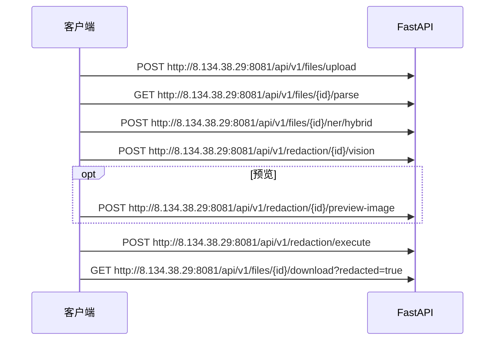

# RedactionEverything API 主场景流程

面向集成与联调的场景化 API 说明。

- **请求地址**：`http://8.134.38.29:8081`
- **基础路径**：`/api/v1`
- **默认端口**：`8081`
- **鉴权**：`AUTH_ENABLED=true` 时在 Header 携带 `Authorization: Bearer <token>`；开发环境可关闭鉴权
- **Swagger UI**：`http://8.134.38.29:8081/docs`（或通过前端 `http://8.134.38.29:8085/docs` 代理）
- **OpenAPI JSON**：`http://8.134.38.29:8081/openapi.json`（不是 `/api/v1/openapi.json`）

---

## 场景索引

| 场景 | 适用 | 核心路径 |
|------|------|----------|
| [0. 服务探活](#0-服务探活) | 部署/运维 | `http://8.134.38.29:8081/health` |
| [1. 认证（可选）](#1-认证可选) | 生产环境 | `http://8.134.38.29:8081/api/v1/auth/*` |
| [2. 单文件·图片/扫描件](#2-单文件图片扫描件) | Playground、jpg/png/扫描 PDF | upload → parse → ner → vision → execute → download |
| [3. 单文件·纯文本](#3-单文件纯文本) | .txt | upload → parse → ner → execute → download |
| [4. 单文件·Word/PDF 文本层](#4-单文件wordpdf-文本层) | 可选视觉 | upload → parse → ner → [vision] → execute → download |
| [5. 批量任务](#5-批量任务) | 批量向导 | jobs → upload → submit → review → export |
| [6. 结构化数据](#6-结构化数据) | CSV/XLSX/DB | structured/files → profile → policy → jobs → export |

---

## 0. 服务探活

确认 API 与模型依赖是否就绪。

| 步骤 | 方法 | 路径 |
|------|------|------|
| 进程存活 | GET | `http://8.134.38.29:8081/health` |
| 模型服务 | GET | `http://8.134.38.29:8081/health/services` |

**请求示例**：

```bash
curl http://8.134.38.29:8081/health
curl http://8.134.38.29:8081/health/services
```

**响应示例**（`http://8.134.38.29:8081/health`）：

```json
{ "status": "healthy", "version": "0.1.0" }
```

---

## 1. 认证（可选）

生产环境启用 `AUTH_ENABLED=true` 时，先登录再调用业务接口。

| 步骤 | 方法 | 路径 | 说明 |
|------|------|------|------|
| 查状态 | GET | `http://8.134.38.29:8081/api/v1/auth/status` | 是否已设密码、是否已登录 |
| 首次设密 | POST | `http://8.134.38.29:8081/api/v1/auth/setup` | 仅首次部署 |
| 登录 | POST | `http://8.134.38.29:8081/api/v1/auth/login` | 返回 JWT |

**登录请求**：

```json
{ "username": "admin", "password": "YourStrongPass123!" }
```

**登录响应**：

```json
{ "access_token": "<jwt>", "token_type": "bearer", "expires_in": 86400 }
```

**登录示例**：

```bash
curl -X POST http://8.134.38.29:8081/api/v1/auth/login \
  -H "Content-Type: application/json" \
  -d '{"username":"admin","password":"YourStrongPass123!"}'
```

后续请求：

```bash
curl -H "Authorization: Bearer $TOKEN" http://8.134.38.29:8081/api/v1/...
```

---

## 2. 单文件·图片/扫描件

Playground 默认链路：OCR + 文本 NER + 视觉检测 → 执行遮罩/替换 → 下载。



### 步骤 1 · 上传

**POST** `http://8.134.38.29:8081/api/v1/files/upload` · Content-Type: `multipart/form-data`

```bash
curl -X POST http://8.134.38.29:8081/api/v1/files/upload \
  -F "file=@./sample.jpg" \
  -F "upload_source=playground"
```

**响应**：

```json
{
  "file_id": "a1b2c3d4-e5f6-7890-abcd-ef1234567890",
  "filename": "contract.jpg",
  "file_type": "image",
  "file_size": 245760,
  "page_count": 1
}
```

### 步骤 2 · 解析（OCR 前置）

**GET** `http://8.134.38.29:8081/api/v1/files/{file_id}/parse`

```bash
curl http://8.134.38.29:8081/api/v1/files/{file_id}/parse
```

**响应**（图片通常 `is_scanned=true`，文本在 OCR 阶段填充）：

```json
{
  "file_id": "a1b2c3d4-...",
  "file_type": "image",
  "content": "",
  "page_count": 1,
  "is_scanned": true
}
```

### 步骤 3 · 文本 NER

**POST** `http://8.134.38.29:8081/api/v1/files/{file_id}/ner/hybrid`

```bash
curl -X POST http://8.134.38.29:8081/api/v1/files/{file_id}/ner/hybrid \
  -H "Content-Type: application/json" \
  -d '{"entity_type_ids": null}'
```

**请求**（`null` = 使用当前启用的实体类型）：

```json
{ "entity_type_ids": null }
```

**响应**（保留 `entities` 供 execute 使用）：

```json
{
  "file_id": "a1b2c3d4-...",
  "entity_count": 2,
  "entities": [
    {
      "id": "ent-001",
      "text": "张三",
      "type": "PERSON",
      "start": 0,
      "end": 2,
      "page": 1,
      "confidence": 0.96,
      "selected": true
    }
  ]
}
```

### 步骤 4 · 视觉识别

**POST** `http://8.134.38.29:8081/api/v1/redaction/{file_id}/vision?page=1&include_result_image=false`

```bash
curl -X POST "http://8.134.38.29:8081/api/v1/redaction/{file_id}/vision?page=1&include_result_image=false" \
  -H "Content-Type: application/json" \
  -d '{}'
```

**请求**（空对象 = 默认视觉类型）：

```json
{}
```

**响应**（保留 `bounding_boxes` 供 execute 使用）：

```json
{
  "file_id": "a1b2c3d4-...",
  "page": 1,
  "bounding_boxes": [
    {
      "id": "box-001",
      "x": 0.12,
      "y": 0.34,
      "width": 0.08,
      "height": 0.06,
      "page": 1,
      "type": "SEAL",
      "selected": true,
      "source": "visual_features"
    }
  ]
}
```

### 步骤 5 · 预览遮罩（可选）

**POST** `http://8.134.38.29:8081/api/v1/redaction/{file_id}/preview-image?page=1`

```bash
curl -X POST "http://8.134.38.29:8081/api/v1/redaction/{file_id}/preview-image?page=1" \
  -H "Content-Type: application/json" \
  -d '{"bounding_boxes":[],"config":{"image_redaction_method":"mosaic","image_redaction_strength":75}}'
```

**请求**：

```json
{
  "bounding_boxes": [ "...上一步选中的 box..." ],
  "config": {
    "image_redaction_method": "mosaic",
    "image_redaction_strength": 75
  }
}
```

**响应**：`{ "file_id", "page", "image_base64": "<png>" }`

### 步骤 6 · 执行匿名化

**POST** `http://8.134.38.29:8081/api/v1/redaction/execute` · Header: `X-Idempotency-Key`（可选，防重复提交）

```bash
curl -X POST http://8.134.38.29:8081/api/v1/redaction/execute \
  -H "Content-Type: application/json" \
  -H "X-Idempotency-Key: demo-001" \
  -d @execute-body.json
```

**请求**（合并 NER 实体 + 视觉框）：

```json
{
  "file_id": "a1b2c3d4-e5f6-7890-abcd-ef1234567890",
  "entities": [ "...ner 返回且 selected=true 的项..." ],
  "bounding_boxes": [ "...vision 返回且 selected=true 的项..." ],
  "config": {
    "replacement_mode": "smart",
    "image_redaction_method": "mosaic",
    "image_redaction_strength": 75
  }
}
```

**响应**：

```json
{
  "file_id": "a1b2c3d4-...",
  "output_file_id": "out-uuid",
  "redacted_count": 2,
  "entity_map": { "张三": "[人物1]" },
  "download_url": "http://8.134.38.29:8081/api/v1/files/a1b2c3d4-.../download?redacted=true"
}
```

### 步骤 7 · 下载 & 报告

| 动作 | 方法 | 路径 |
|------|------|------|
| 下载脱敏文件 | GET | `http://8.134.38.29:8081/api/v1/files/{file_id}/download?redacted=true` |
| 脱敏报告 | GET | `http://8.134.38.29:8081/api/v1/redaction/{file_id}/report` |
| 前后对比 | GET | `http://8.134.38.29:8081/api/v1/redaction/{file_id}/compare` |

```bash
curl -L "http://8.134.38.29:8081/api/v1/files/{file_id}/download?redacted=true" -o redacted.bin
curl http://8.134.38.29:8081/api/v1/redaction/{file_id}/report
curl http://8.134.38.29:8081/api/v1/redaction/{file_id}/compare
```

---

## 3. 单文件·纯文本

`.txt` 无视觉区域，**跳过 vision / preview-image**。

| 顺序 | 方法 | 路径 |
|------|------|------|
| 1 | POST | `http://8.134.38.29:8081/api/v1/files/upload` |
| 2 | GET | `http://8.134.38.29:8081/api/v1/files/{file_id}/parse` |
| 3 | POST | `http://8.134.38.29:8081/api/v1/files/{file_id}/ner/hybrid` |
| 4 | POST | `http://8.134.38.29:8081/api/v1/redaction/execute` |
| 5 | GET | `http://8.134.38.29:8081/api/v1/files/{file_id}/download?redacted=true` |

**execute 请求**：`bounding_boxes` 传空数组 `[]`，仅传 `entities`。

**可选**：`POST http://8.134.38.29:8081/api/v1/redaction/preview-map` 预览文本替换表，不落盘。

---

## 4. 单文件·Word/PDF 文本层

有可提取文本层的 Word/PDF：`parse` 返回 `content` / `pages`，`is_scanned=false`。

| 顺序 | 说明 |
|------|------|
| upload → parse → ner/hybrid | 同上单文件 |
| vision | **可选**；扫描页或需遮印章/人脸时调用 |
| execute | 文本实体必选；有视觉框时一并传入 `bounding_boxes` |
| download | `?redacted=true` |

多页 PDF：`vision` 与 `preview-image` 通过 `?page=N` 逐页处理；`execute` 一次提交所有页的 entities/boxes。

---

## 5. 批量任务

批量向导：创建 Job → 上传并绑定文件 → 提交识别 → 复核（可选）→ 打包导出。

```text
POST http://8.134.38.29:8081/api/v1/jobs                          # 创建草稿
POST http://8.134.38.29:8081/api/v1/files/upload                  # 上传（可带 job_id）
POST http://8.134.38.29:8081/api/v1/jobs/{job_id}/items           # 绑定 file_id
POST http://8.134.38.29:8081/api/v1/jobs/{job_id}/submit          # 提交队列识别
GET  http://8.134.38.29:8081/api/v1/jobs/{job_id}/stream          # SSE 进度（可选）
GET  http://8.134.38.29:8081/api/v1/jobs/{job_id}/items/{item_id}/review-draft
PUT  http://8.134.38.29:8081/api/v1/jobs/{job_id}/items/{item_id}/review-draft   # 保存复核编辑
POST http://8.134.38.29:8081/api/v1/jobs/{job_id}/items/{item_id}/review/commit  # 提交复核并脱敏
POST http://8.134.38.29:8081/api/v1/files/batch/download          # ZIP 打包下载
GET  http://8.134.38.29:8081/api/v1/jobs/{job_id}/export-report   # 导出报告 JSON
```

### 5.1 创建 Job

**POST** `http://8.134.38.29:8081/api/v1/jobs`

**请求**（字段以实际 preset / mode 为准，示例）：

```json
{
  "title": "批次-20260626",
  "job_type": "smart_batch",
  "config": { "preset_id": "<preset_id>" }
}
```

**响应**：`{ "id": "job-uuid", "status": "draft", ... }`

### 5.2 上传并绑定

```bash
curl -F "file=@./a.pdf" -F "job_id=$JOB_ID" -F "upload_source=batch" \
  http://8.134.38.29:8081/api/v1/files/upload
```

**POST** `http://8.134.38.29:8081/api/v1/jobs/{job_id}/items`

```json
{ "file_id": "a1b2c3d4-..." }
```

### 5.3 提交识别

**POST** `http://8.134.38.29:8081/api/v1/jobs/{job_id}/submit`

轮询：`GET http://8.134.38.29:8081/api/v1/jobs/{job_id}` 或 SSE `GET http://8.134.38.29:8081/api/v1/jobs/{job_id}/stream`。

### 5.4 复核与提交脱敏

识别完成后 item 进入 `awaiting_review`（若 Job 未跳过复核）：

1. **GET** `http://8.134.38.29:8081/api/v1/jobs/{job_id}/items/{item_id}/review-draft` — 读取识别结果草稿
2. **PUT** `http://8.134.38.29:8081/api/v1/jobs/{job_id}/items/{item_id}/review-draft` — 保存人工编辑的 entities / bounding_boxes
3. **POST** `http://8.134.38.29:8081/api/v1/jobs/{job_id}/items/{item_id}/review/commit` — 执行该项最终脱敏

**commit 请求体**与单文件 `execute` 类似（entities + bounding_boxes + config）。

若 Job 配置 `skip_item_review=true`，worker 识别后可自动脱敏，跳过复核三步。

### 5.5 导出

**POST** `http://8.134.38.29:8081/api/v1/files/batch/download`

```json
{
  "file_ids": ["id-1", "id-2"],
  "redacted": true,
  "job_id": "job-uuid"
}
```

响应为 **ZIP 二进制流**。

---

## 6. 结构化数据

CSV / XLSX / 数据库表的列级脱敏。

```text
POST http://8.134.38.29:8081/api/v1/structured/files                    # 上传文件型数据集
  或 POST http://8.134.38.29:8081/api/v1/structured/connections         # 注册数据库连接
POST http://8.134.38.29:8081/api/v1/structured/datasets/{id}/profile    # 列画像
PUT  http://8.134.38.29:8081/api/v1/structured/datasets/{id}/policy       # 保存列策略
GET  http://8.134.38.29:8081/api/v1/structured/datasets/{id}/preview      # 预览（可选）
POST http://8.134.38.29:8081/api/v1/structured/jobs                       # 执行脱敏
GET  http://8.134.38.29:8081/api/v1/structured/jobs/{job_id}/export       # 下载结果
```

### 6.1 上传数据集

**POST** `http://8.134.38.29:8081/api/v1/structured/files` · Content-Type: `multipart/form-data`，字段 `file`

**响应**：`{ "dataset_id": "ds-uuid", ... }`

### 6.2 列画像

**POST** `http://8.134.38.29:8081/api/v1/structured/datasets/{dataset_id}/profile`

**响应示例**：

```json
{
  "dataset_id": "ds-uuid",
  "columns": [
    { "name": "phone", "inferred_type": "phone", "recommended_action": "mask" }
  ]
}
```

### 6.3 保存策略

**PUT** `http://8.134.38.29:8081/api/v1/structured/datasets/{dataset_id}/policy`

```json
{
  "columns": [
    { "column": "phone", "action": "mask", "enabled": true },
    { "column": "name", "action": "hash", "enabled": true }
  ]
}
```

列动作：`keep` | `drop` | `mask` | `hash` | `generalize`

### 6.4 执行并导出

| 步骤 | 方法 | 路径 |
|------|------|------|
| 执行 | POST | `http://8.134.38.29:8081/api/v1/structured/jobs` |
| 下载 | GET | `http://8.134.38.29:8081/api/v1/structured/jobs/{job_id}/export` |

**执行请求**：

```json
{ "dataset_id": "ds-uuid", "output_format": "csv" }
```
